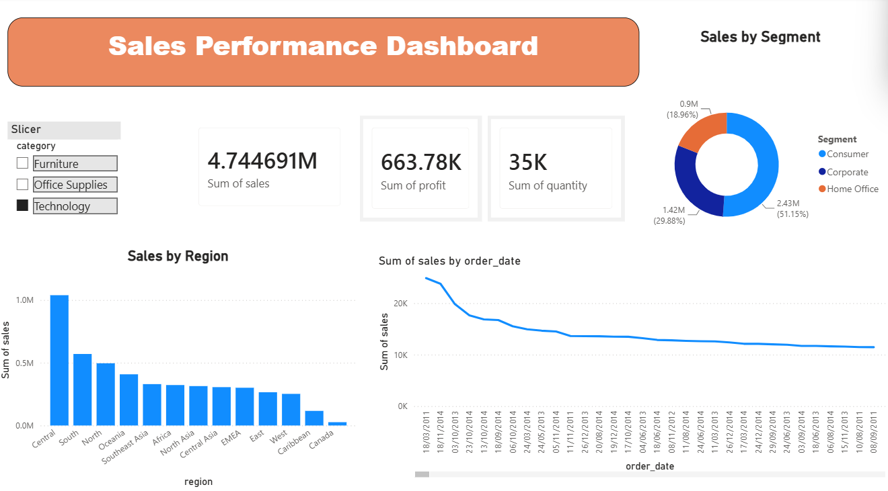

# Ecommerce Sales Analysis 🚀

An end-to-end Data Analytics project showcasing the journey from raw data cleaning to actionable business insights.

## 📊 Dashboard Preview

## 🛠 Tech Stack
- **Python**: Used for Data Cleaning, EDA (Exploratory Data Analysis), and handling missing values.
- **SQL**: Used for data extraction, joining tables, and complex querying.
- **Power BI**: Used for creating interactive visualizations and tracking KPIs (Sales, Profit, Trends).

## 💡 Key Insights
- **Top Performing Region**: [Apne analysis ke hisaab se likho, jaise: Western Region]
- **Highest Profit Category**: [Likho, jaise: Technology/Furniture]
- **Monthly Trend**: Sales peaked during [Month Name] due to seasonal demand.

## 📁 Project Structure
- `cleaned_sales_data.csv`: The processed dataset.
- `analysis_queries.sql`: SQL scripts used for data analysis.
- `Ecommerce_Sales_Dashboard.pbix`: The Power BI report file.
- `Aryan_Portfolio_Deck.html`: Detailed project presentation.

## 🔗 Connect With Me
- [LinkedIn Profile Link yahan daalo]
- [GitHub Profile Link]
